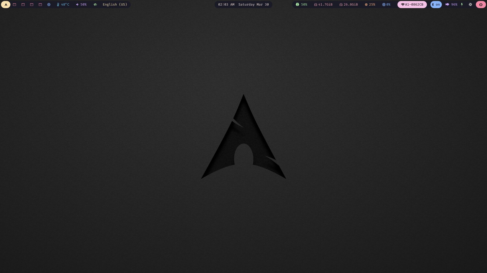
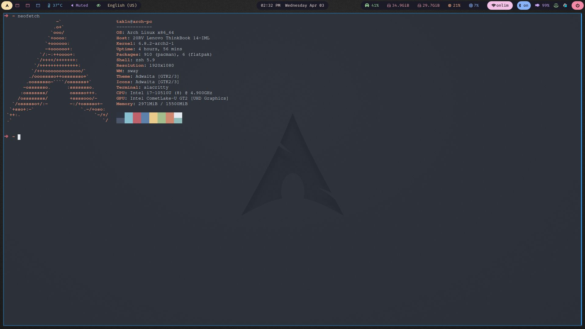
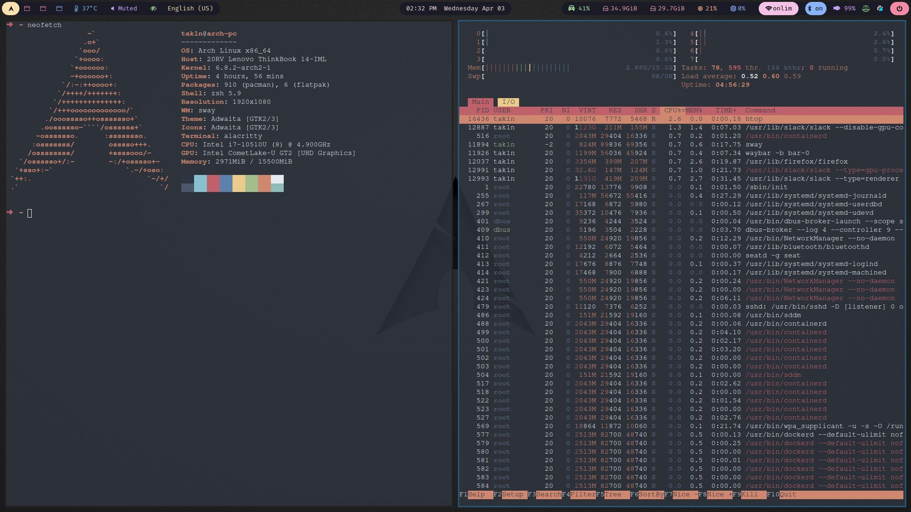
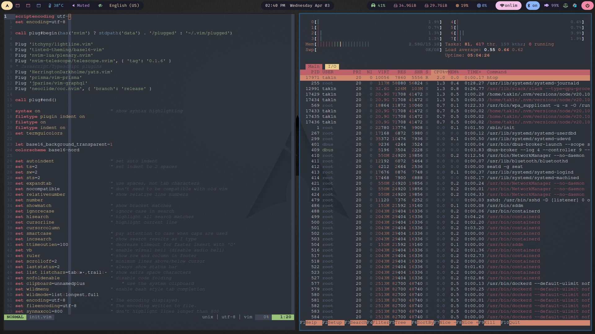

# Dotfiles

Configuration-/Dotfiles for my Arch Linux setup using Wayland. Currently switching between Sway and KDE Plasma as fullblown Desktop Environment.

- Display Manager: [Lemurs](https://github.com/coastalwhite/lemurs)
- Desktop Environment: [KDE Plasma](https://wiki.archlinux.org/title/KDE#Plasma)
- Wayland compositor: [Sway](https://wiki.archlinux.org/title/Sway)
- Menu Bar: [Waybar](https://github.com/Alexays/Waybar)
- Logout Menu: [wlogout](https://github.com/ArtsyMacaw/wlogout)
- Terminal: [Alacritty](https://wiki.archlinux.org/title/Alacritty)
- Shell: [Zsh](https://wiki.archlinux.org/title/Zsh) + [Oh My Zsh](https://ohmyz.sh/)
- Launcher: [Fuzzel](https://codeberg.org/dnkl/fuzzel)
- File Manager: [Nemo](https://wiki.archlinux.org/title/Nemo)
- Editor: [NeoVim](https://wiki.archlinux.org/title/Neovim), [VSCode](https://wiki.archlinux.org/title/Visual_Studio_Code)
- Color scheme: [Shell](https://github.com/chriskempson/base16-shell) + [NVIM](https://github.com/tinted-theming/base16-vim) Base16 Nord
- Webbrowser: [FireFox](https://wiki.archlinux.org/title/Firefox)

